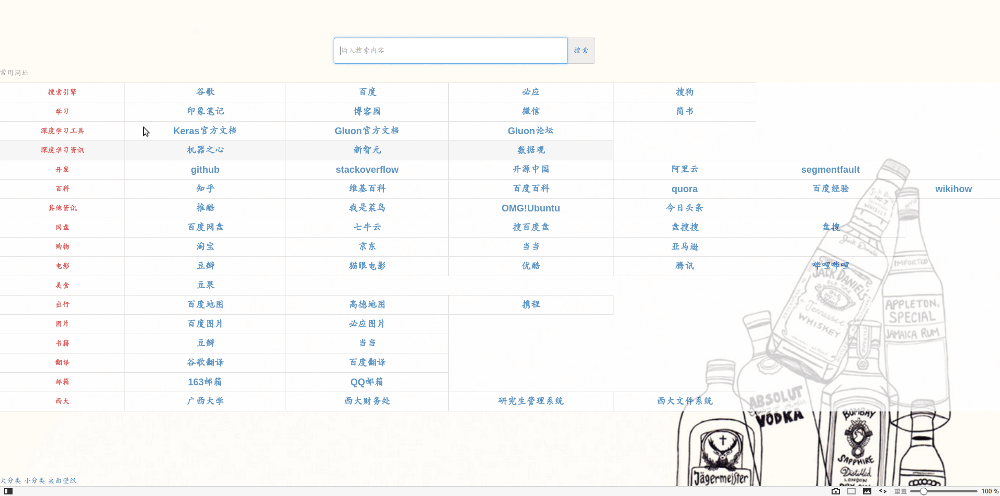
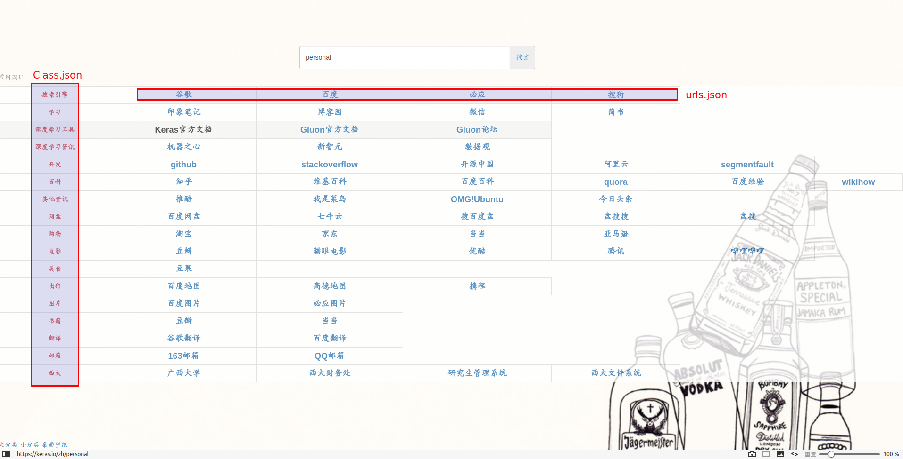

# broswer_home_page.github.io

## 1.项目介绍
该项目是自己编写的定制导航页,通过使用AngularJS和Bootstrap来完成.

## 2.大体流程
通过加载两个json文件来生成页面,Class.json表示显示在页面上的大类信息,urls.json表示显示在各大类下的子链接

## 3.如何使用
1.可以fork该项目到自己仓库中,通过设置**GitHub Pages**来访问该项目.
2.通过修改两个json文件来定制自己的专属导航页
3.可以修改显示壁纸

## 4.操作流程
目前只能是单搜索,即输入一个关键字到搜索框,点击一个要搜索的网站,如:

注:目前也没实现回车执行搜索.

## 4.页面预览

注:由于本人专业所限,可能在简洁,美化方面做的不好
